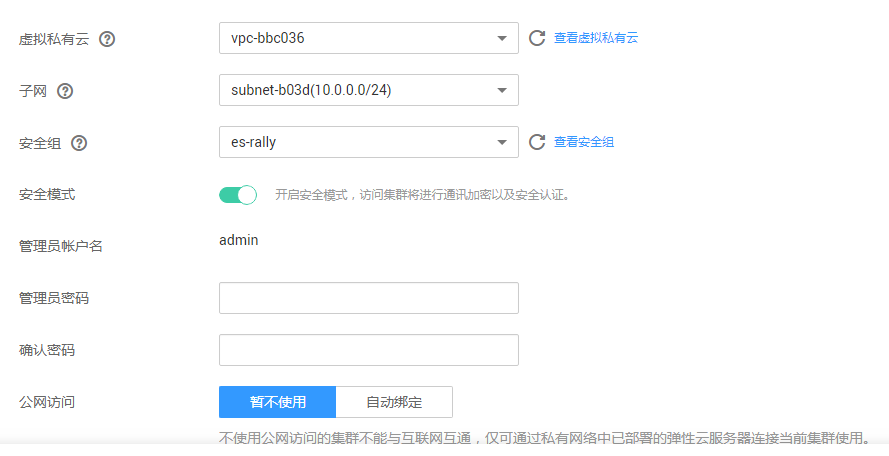
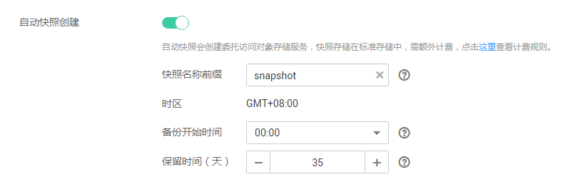

# 创建集群

在开始使用云搜索服务时，您必须创建一个集群。

## 背景信息

-   如果您要以折扣套餐计费方式使用集群，则需要提前购买折扣套餐，再创建与折扣套餐中区域、节点规格或者节点存储相同的集群。购买折扣套餐的具体操作步骤，请参见《价格说明》中的[折扣套餐](https://support.huaweicloud.com/price-css/css_06_0012.html)章节。
-   如果您要以按需计费方式使用集群，则直接创建集群。

## 操作步骤

1.  登录云搜索服务[管理控制台](https://console.huaweicloud.com/elasticsearch/)。
2.  在“总览“或者“集群管理“页面，单击“创建集群“，进入“创建集群”页面。
3.  选择“当前区域“和“可用区“。

    “当前区域“：集群工作区域在右侧下拉框中选择。

    “可用区“：选择集群工作区域下关联的可用区。详细描述可参考[什么是区域和可用区](https://support.huaweicloud.com/css_faq/css_02_0034.html)。

    云搜索服务支持配置多个“可用区”，详细请参考[跨AZ高可用性介绍](https://support.huaweicloud.com/productdesc-css/css_04_0023.html)。

4.  指定集群基本信息，选择“集群版本“，并输入“集群名称“。

    -   “集群版本“：当前支持5.5.1、6.2.3、6.5.4和7.1.1。
    -   “集群名称“：自定义的集群名称，可输入的字符范围为4～32个字符，只能包含数字、字母、中划线和下划线，且必须以字母开头。

    **图 1**  基本信息配置  
    

5.  指定集群的主机规格相关参数。

    **表 1**  参数说明

    
    <table><thead align="left"><tr id="row14509181918241"><th class="cellrowborder" valign="top" width="25%" id="mcps1.2.3.1.1">
参数

    </th>
    <th class="cellrowborder" valign="top" width="75%" id="mcps1.2.3.1.2">
说明

    </th>
    </tr>
    </thead>
    <tbody><tr id="row15509111982410"><td class="cellrowborder" valign="top" width="25%" headers="mcps1.2.3.1.1 ">
“节点数量”

    </td>
    <td class="cellrowborder" valign="top" width="75%" headers="mcps1.2.3.1.2 ">
集群中的节点个数。

    <ul id="ul55091419152414"><li>如果未启用Master节点和Client节点时，此参数指定的节点将被作为Master节点和Client节点，同时具备集群管理、存储数据、提供接入集群和分析数据的服务。此时，为保证集群中数据的稳定性，建议设置节点数量大于等于3个。</li><li>如果启用Master节点，且未启用Client节点，此参数指定的节点将用于存储数据并提供Client节点功能。</li><li>如果已启用Master节点和Client节点，此参数指定的节点将仅用于存储数据。</li><li>如果启用Client节点，且未启用Maste节点，此参数指定的节点将用于存储数据并提供Master节点功能。</li></ul>
    </td>
    </tr>
    <tr id="row65090196243"><td class="cellrowborder" valign="top" width="25%" headers="mcps1.2.3.1.1 ">
“节点规格”

    </td>
    <td class="cellrowborder" valign="top" width="75%" headers="mcps1.2.3.1.2 ">
集群中的节点规格。

    
您可以选择任一系列，然后从对应系列中根据需要选择一个规格。每个集群只能选择一个规格，规格的详细说明可参考<a href="https://support.huaweicloud.com/productdesc-ecs/zh-cn_topic_0035470096.html" target="_blank" rel="noopener noreferrer">弹性云服务器的实例类型与规格</a>。您不能选择已售罄的CPU和内存资源。

    </td>
    </tr>
    <tr id="row175091919122413"><td class="cellrowborder" valign="top" width="25%" headers="mcps1.2.3.1.1 ">
“节点存储”

    </td>
    <td class="cellrowborder" valign="top" width="75%" headers="mcps1.2.3.1.2 ">
当前支持三种存储类型，普通I/O、高I/O、超高I/O。

    </td>
    </tr>
    <tr id="row250912197249"><td class="cellrowborder" valign="top" width="25%" headers="mcps1.2.3.1.1 ">
“节点存储容量”

    </td>
    <td class="cellrowborder" valign="top" width="75%" headers="mcps1.2.3.1.2 ">
存储空间大小，其取值范围与节点规格关联，不同的规格允许的取值范围不同。

    </td>
    </tr>
    <tr id="row155091119132418"><td class="cellrowborder" valign="top" width="25%" headers="mcps1.2.3.1.1 ">
“启用Master节点”

    </td>
    <td class="cellrowborder" valign="top" width="75%" headers="mcps1.2.3.1.2 ">
Master节点用于管理集群中的所有节点。当需要存储和分析的数据量大，所需节点数量大于20个节点时，建议启用Master节点，保证集群的稳定性。反之，建议购买节点同时作为Master和Client节点即可，即仅设置集群的“节点数量”参数。

    
启用Master节点后，在下方选择对应的“节点规格”、“节点数量”和“节点存储”。“节点数量”必须是大于3的奇数，最多设置9个节点。其中“节点存储”的存储容量为固定值，存储类型可以根据实际情况选择，默认为存储容量为40GB的高I/O磁盘。

    
 说明： 

只有开通大集群权限的用户才能配置“启用Master节点”和“启用Client节点”参数。

    

    </td>
    </tr>
    <tr id="row18509171911243"><td class="cellrowborder" valign="top" width="25%" headers="mcps1.2.3.1.1 ">
“启用Client节点”

    </td>
    <td class="cellrowborder" valign="top" width="75%" headers="mcps1.2.3.1.2 ">
Client节点用于提供客户端接入集群和分析数据的服务。当需要存储和分析的数据量大，所需节点数量大于20个节点时，建议启用Client节点，保证集群的稳定性。反之，建议购买节点同时作为Master和Client节点即可，即仅设置集群的“节点数量”参数。

    
启用Client节点后，在下方选择对应的“节点规格”、“节点数量”和“节点存储”。“节点数量”可设置为1~32任意数值。其中“节点存储”的存储容量为固定值，存储类型可以根据实际情况选择，默认为存储容量为40GB的高I/O磁盘。

    </td>
    </tr>
    <tr id="row12889131219416"><td class="cellrowborder" valign="top" width="25%" headers="mcps1.2.3.1.1 ">
“启用冷数据节点”

    </td>
    <td class="cellrowborder" valign="top" width="75%" headers="mcps1.2.3.1.2 ">
冷数据节点用于存放对于历史数据要求分钟级别的返回。当用户对历史数据返回时间要求不是很高的话，可以将这部分数据存储在冷数据节点上，从而降低成本。

    
冷数据节点为可选节点，支持的节点个数为1-32个。

    
开启冷数据节点之后，云搜索服务将会自动的给相关节点打上冷热标签，相关的集群参数，配置详情请参见<a href="https://www.elastic.co/guide/en/elasticsearch/reference/master/allocation-awareness.html" target="_blank" rel="noopener noreferrer">https://www.elastic.co/guide/en/elasticsearch/reference/master/allocation-awareness.html</a>。

    </td>
    </tr>
    </tbody>
    </table>

    **图 2**  设置主机规格  
    

6.  指定集群的网络规格相关参数，包括“虚拟私有云“、“子网“和“安全组“。

    -   “虚拟私有云“：VPC即虚拟私有云，是通过逻辑方式进行网络隔离，提供安全、隔离的网络环境。

        选择创建集群需要的VPC，单击“查看虚拟私有云“进入VPC服务查看已创建的VPC名称和ID。如果没有VPC，需要创建一个新的VPC。

        > **说明：**   
        >此处您选择的VPC必须包含网段（CIDR），否则集群将无法创建成功。新建的VPC默认包含网段（CIDR）。  

    -   “子网“：通过子网提供与其他网络隔离的、可以独享的网络资源，以提高网络安全。

        选择创建集群需要的子网，可进入VPC服务查看VPC下已创建的子网名称和ID。

    -   “安全组“：安全组是一个逻辑上的分组，为同一个VPC内具有相同安全保护需求并相互信任的弹性云服务器提供访问策略。单击“查看安全组“可了解安全组详情。

        > **说明：**   
        >请确保安全组的“端口范围/ICMP类型“为“Any“或者包含端口9200的端口范围。  

    -   **“安全模式”**：在6.5.4以及之后版本中提供了安全模式的选择，开启之后将对集群进行通讯加密和安全认证，管理员账户名默认为admin，需要设置管理员密码并确认密码。参考《产品介绍》中的[安全模式集群简介](https://support.huaweicloud.com/productdesc-css/css_04_0019.html)可了解安全模式详情。
    -   **“公网访问”**：只有开启“安全模式“的集群，才能配置公网访问。开启公网访问后，用户可以获得一个公网访问的IP，通过这个IP，可以在公网上面访问该集群。详细配置请参考[公网访问](公网访问.md)。

    **图 3**  设置网络规格  
    

    **图 4**  设置网络规格（安全模式）  
    

7.  设置标签和企业项目。
    -   标签：为集群添加标签，可以方便用户识别和管理拥有的集群资源。此处您可以选择“标签管理服务“中已定义好的“预定义标签“，也可以自己定义标签。详细标签使用请参考[管理标签](管理标签.md)。
    -   企业项目：如果您开通了企业项目，在创建云搜索服务集群时，您可以给集群绑定一个企业项目。您可以在右侧下拉框中选择当前用户下已创建的企业项目，也可以前往“项目管理服务“管理控制台，新建企业项目。可单击“查看项目管理“按钮，前往“项目管理服务“，了解已有的企业项目。

8.  设置集群快照的相关参数。

    默认情况下，系统打开了“自动快照创建“开关，您可以根据自己的需求设置“快照名称前缀“、“备份开始时间“和“保留时间（天）“。如果您不需要启用自动快照，可以在“自动快照创建“右侧，单击开关关闭自动创建快照功能。

    -   “快照名称前缀“：快照名称由快照名称前缀加上时间戳组成，例如自动生成的快照名称snapshot-1566921603720。快照名称前缀的长度为1～32个字符，只能包含小写字母、数字、中划线和下划线，且必须以小写字母开头。
    -   “备份开始时间“：指每天自动开始备份的时间，只能指定整点时间，如00:00、01:00，取值范围为00:00～23:00。请在下拉框中选择备份时间。
    -   “保留时间（天）“：指备份的快照在OBS的保留时间，以天为单位，取值范围为1～90，您可以根据自己的需求进行设置。系统在半点时刻会自动删除超过保留时间的快照。

    例如：自动创建快照的策略设置如[图5](#fig438122816367)所示，则系统会在35天后的00:30自动删除35天前00:00自动开始备份的快照。

    **图 5**  设置自动创建快照的相关参数  
    

9.  单击“立即申请“，进入规格确认界面。
10. 规格确认完成后，单击“提交申请“开始创建集群。
11. 单击“返回集群列表“，系统将跳转到“集群管理“页面。您创建的集群将展现在集群列表中，且集群状态为“创建中“，创建成功后集群状态会变为“可用“。

    如果集群创建失败，请根据界面提示，重新创建集群。

